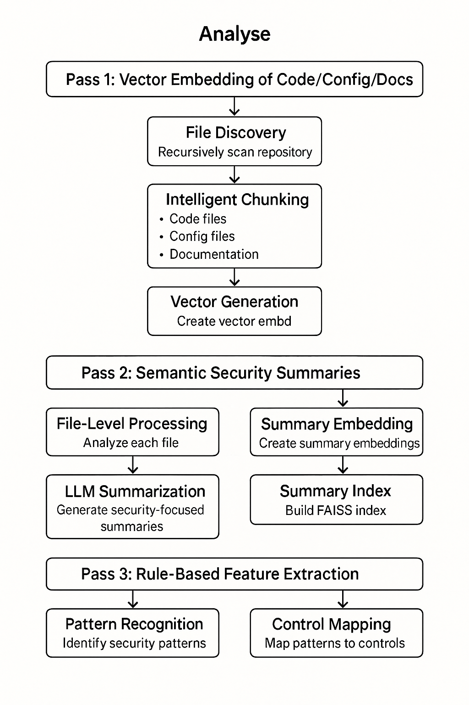
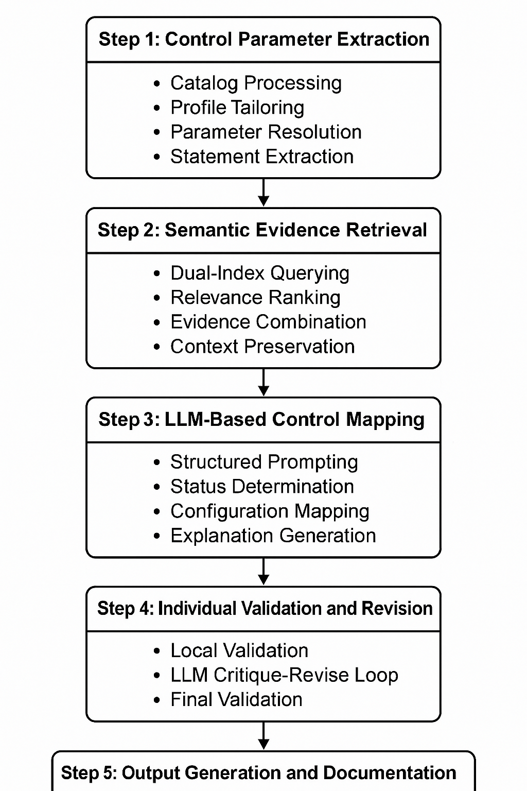

# MapOSCAL

## TL;DR
Software must be accurately described for security and compliance purposes.  NIST's OSCAL appears to be the defined format of the immediate future, however industry adoption hasn't reached its potential.  This project makes OSCAL usable by providing automated discovery in an engineering-friendly CLI tool, which enables your security architects to be focused on the details, not the documentation generation!

## Overview

Cybersecurity, risk management, as well as regulatory compliance requirements all hinge on a method to accurately describe your system's working environment and configuration.  The purpose of this project is to assist the software industry in easily creating standardized software component definitions, specifically to further the interoperability of security and compliance requirements.  This takes place using the foundation of [Open Security Controls Assessment Language (OSCAL)](https://pages.nist.gov/OSCAL/) Framework developed by the National Institute of Standards and Technology (NIST).  

Creating and maintaining an OSCAL definition of your system/software is not a trivial task.  With OSCAL being a machine-readable format, it's usually accessed as JSON or XML, or using an programmatic SDK.  Some UI's exist to improve human interaction, however, it's still a tedious process that requires significant subject matter expertise for mundane tasks.  This project seeks to simplify that pain-point by providing an engineering-focused CLI interface that allows for the dynamic drafting of your OSCAL system defintion based on automated discovery techniques.  Released under the generous MIT License, its goal is to provide core discovery functionality to as wide an audience as possible.  Using the generated output, your system's SMEs (with their highly-valued time) load is shifted from weeks of creating tedious documentation to a more effecient review process of automatically-generated documentation.  Its goal and purpose is not to replace such individuals, but to enable them to serve where their expertise is most valuable, not drafting documentation.

### Generative AI and OSCAL Discovery

While extremely powerful, generative AI can be equally dangerous in producing false, hallucinatory results if not properly implemented with guardrails.  The benefits of using generative AI are only valuable when produced in a framework that allows its powerful pattern-recognition to be assured by non-generative methods.  In this open source project, pains have been taken to place guardrails at a high-level view of your application.  If there is project growth, in a future commercial version there is planned to be much more granular controls, moving from the application and file level, into functions, relationships, and other more granular aspects.

### Compliance Control Implementation Statements

Having an OSCAL-based system defintion is only half of the compliance battle.  To be truely effective that definition must be distilled into accurate implementation statements that are tied to one or more compliance frameworks.  In this open source implementation we have included a single control definition and mapping for example purposes.  If future growth occurs, more are desired to be offered as part of a future, commercial offering.

### Validation and Quality Assurance

MapOSCAL includes comprehensive validation and evaluation capabilities to ensure the quality and accuracy of generated OSCAL components:

- **Local Validation**: Fast, deterministic validation using Pydantic schemas for structural correctness
- **LLM-Assisted Fixes**: Intelligent fixing of complex issues that require understanding context
- **Quality Evaluation**: AI-powered assessment of control mapping quality and completeness
- **Comprehensive Reporting**: Detailed validation failures and evaluation results

### Security Overview Integration

MapOSCAL now includes a comprehensive security overview generation feature that provides high-level security context for all control mapping operations:

- **Service Security Summary**: Generates detailed security overviews including authentication, encryption, and audit capabilities
- **Context-Aware Control Mapping**: Uses the security overview as reference context for more accurate control assessments
- **Enhanced Validation**: Incorporates security context into critique and revision processes
- **Improved Accuracy**: Better control status determination through comprehensive service understanding

### Future Growth

The industry is currently struggling to have a clean, clear, and actionable way to describe systems for security and compliance purposes.  Our view is that the ideal path forward to improve this problem space is two-fold:

1. **Foundational open source adoption** -  Having a wide-spread use of OSCAL across both commercial/propriatary as well as commonly-used open source projects is key to future, normalized usage and adoption.  With such service definitions an accurate, building-block approach can be achieved to accurately describe complex systems.  This movement grows everytime a project is defined in OSCAL and available for usage by others.

2. **Robust commercial support** - While this project is foundational and released as open source, requires significant investment in ongoing compliance-related content generation and maintenance.  As such, it is desirable to have commercial add-ons in the future to benefit users with turn-key compliance needs.

## Recent Improvements

MapOSCAL has undergone significant improvements to enhance usability, accuracy, and maintainability:

### Security Overview Integration
- **New `summarize` command**: Generates comprehensive security overviews of services
- **Context-aware control mapping**: Uses security overview as reference for better accuracy
- **Enhanced validation**: Incorporates security context into critique and revision processes
- **Improved explanations**: Better control status determination through service understanding

### Simplified File Management
- **Removed service prefixes**: All files now use simple, consistent naming
- **Unique output directories**: Each service uses a dedicated output directory for isolation
- **Cleaner file structure**: Simplified file paths and naming conventions
- **Better organization**: Clear separation of analysis, generation, and evaluation outputs

### Enhanced CLI Experience
- **Consistent command interface**: All commands now use config files for simplicity
- **Improved error handling**: Better error messages and guidance for users
- **Streamlined workflow**: Logical progression from analysis to evaluation
- **Better documentation**: Comprehensive help text and usage examples

### Improved Code Quality
- **Function-based architecture**: Removed unnecessary class instantiations
- **Better error handling**: More robust error handling and recovery
- **Enhanced logging**: Improved logging throughout the codebase
- **Cleaner imports**: Simplified import structure and dependencies

### Validation and Quality Assurance
- **Comprehensive validation**: Multi-layer validation with automatic fixes
- **LLM-assisted resolution**: Intelligent fixing of complex validation issues
- **Quality evaluation**: AI-powered assessment of control mapping quality
- **Detailed reporting**: Comprehensive validation and evaluation reports

These improvements make MapOSCAL more user-friendly, accurate, and maintainable while providing better security context for control mapping operations.

## Installation

### Prerequisites
- Python 3.8 or higher
- pip (Python package installer)

### Setup
0. OpenAI API Key:
This open source configuration currently only supports OpenAI's API functionality for the LLM-based operations.  You will need to configure your environmental variable "OPENAI_API_KEY" to have a valid API key.

2. Clone the repository:
```bash
git clone https://github.com/yourusername/MapOSCAL.git
cd MapOSCAL
```

2. Create and activate a virtual environment (recommended):
```bash
python -m venv .venv
source .venv/bin/activate  # On Windows, use `.venv\Scripts\activate`
```

3. Install the package:
```bash
pip install -e .
```

For development, install with additional dependencies:
```bash
pip install -e ".[dev]"
```

## Usage

### Configuration

Create a configuration file (e.g., `config.yaml`) with the following structure:
```yaml
title: "your_service_name"
description: "Description of your service"
repo_path: "/path/to/your/repository"
output_dir: ".oscalgen"
top_k: 5
catalog_path: "path/to/NIST_catalog.json"
profile_path: "path/to/NIST_profile.json"
max_critique_retries: 3  # Number of validation/fix attempts

# Configuration file handling (optional)
# Option 1: Auto-discover config files by extension (default behavior)
# If auto_discover_config is true and config_extensions is provided, 
# files with these extensions will be treated as configuration files
config_extensions:
  - ".yaml"
  - ".yml"
  - ".json"
  - ".toml"
  - ".ini"
  - ".conf"
  - ".properties"
  - ".env"
  - ".cfg"

# Option 2: Manual list of configuration files
# If auto_discover_config is false, specify exact files to process as config files
# auto_discover_config: false
# config_files:
#   - "config/database.yaml"
#   - "config/app.json"
#   - ".env"
#   - "docker-compose.yml"
```

**Configuration Options:**
- `title`: Name of your service
- `description`: Description of your service
- `repo_path`: Path to the repository to analyze
- `output_dir`: Directory where analysis and generation outputs will be stored
- `top_k`: Number of most relevant code chunks to retrieve for each control
- `catalog_path`: Path to the OSCAL catalog file (e.g., NIST SP 800-53)
- `profile_path`: Path to the OSCAL profile file (e.g., FedRAMP baseline)
- `max_critique_retries`: Maximum number of validation/fix attempts (default: 3)
- `config_extensions`: List of file extensions to treat as configuration files (when `auto_discover_config` is True)
- `auto_discover_config`: Whether to auto-discover config files by extension or use manual file list (default: True)
- `config_files`: List of specific file paths to treat as configuration files (when `auto_discover_config` is False)

### Commands

The tool provides four main commands:

1. **Analyze Repository**
```bash
maposcal analyze config.yaml
```
This command analyzes your repository and generates initial OSCAL component definitions.

2. **Generate Security Overview**
```bash
maposcal summarize config.yaml
```
This command generates a comprehensive security overview of the service, including:
- Service architecture and technical stack
- Authentication and authorization mechanisms
- Encryption and data protection measures
- Audit logging and monitoring capabilities

The security overview is used as reference context for improved control mapping accuracy.

3. **Generate OSCAL Component**
```bash
maposcal generate config.yaml
```
This command generates the final OSCAL component definitions based on the analysis and control mappings. It includes:
- Individual control validation with automatic fixes
- LLM-assisted resolution of complex issues
- Security overview integration for better context
- Comprehensive validation reporting
- Generation of validation failure logs

4. **Evaluate OSCAL Component Quality**
```bash
maposcal evaluate config.yaml
```
This command evaluates the quality of existing OSCAL component definitions using AI-powered assessment:
- Scores each control on 4 quality dimensions (0-2 scale)
- Provides detailed justifications for scores
- Offers improvement recommendations
- Generates comprehensive evaluation reports

### Output Files

The tool generates several output files in the specified `output_dir`:

#### Analysis Files
- `meta.json` - Code chunk metadata and embeddings
- `index.faiss` - FAISS index for semantic search
- `summary_meta.json` - File-level summary metadata
- `summary_index.faiss` - FAISS index for summary search

#### Generated Files
- `implemented_requirements.json` - Validated OSCAL component definitions
- `validation_failures.json` - Detailed validation failure information
- `unvalidated_requirements.json` - Requirements that failed validation
- `security_overview.md` - Comprehensive service security overview

#### Evaluation Files
- `implemented_requirements_evaluation_results.json` - Quality assessment results with scores and recommendations

### Validation Features

#### Local Validation (Fast & Deterministic)
- **Control Status Validation**: Ensures valid control-status values
- **Configuration Structure**: Validates control-configuration format and file extensions
- **OSCAL Structure**: Checks required fields and UUID formats
- **Cross-Reference Validation**: Ensures consistency between status and configuration

#### LLM-Assisted Fixes
- **Automatic Fixes**: Simple issues fixed automatically (file extensions, missing fields)
- **Intelligent Resolution**: Complex issues sent to LLM for context-aware fixing
- **Security Context Integration**: Uses security overview for better understanding
- **Retry Logic**: Multiple attempts to resolve validation issues

#### Quality Evaluation
- **Status Alignment**: Is the control-status correct given the explanation and configuration?
- **Explanation Quality**: Is the control-explanation clear, accurate, and grounded?
- **Configuration Support**: Is the control-configuration specific, correct, and valid?
- **Overall Consistency**: Do all parts reinforce each other without contradiction?

### Example Workflow

1. Create a configuration file:
```yaml
title: "my_service"
description: "My security-critical service"
repo_path: "./my_service"
output_dir: ".oscalgen"
top_k: 5
catalog_path: "examples/NIST_SP-800-53_rev5_catalog.json"
profile_path: "examples/NIST_SP-800-53_rev5_HIGH-baseline_profile.json"
max_critique_retries: 3

# Optional: Configure which files to treat as configuration files
config_extensions:
  - ".yaml"
  - ".yml"
  - ".json"
  - ".env"
  - ".cfg"
```

2. Run the analysis:
```bash
maposcal analyze config.yaml
```

3. Generate security overview:
```bash
maposcal summarize config.yaml
```

4. Generate the OSCAL component:
```bash
maposcal generate config.yaml
```

5. Evaluate the quality of generated components:
```bash
maposcal evaluate config.yaml
```

## Project Structure

- `maposcal/` - Main package directory
  - `analyzer/` - Code analysis components
    - `analyzer.py` - Main analysis workflow
    - `chunker.py` - Code chunking logic
    - `parser.py` - File parsing utilities
    - `rules.py` - Security rule application
  - `generator/` - OSCAL generation components
    - `control_mapper.py` - Control mapping logic
    - `profile_control_extractor.py` - Profile and catalog processing
    - `validation.py` - Comprehensive validation schemas and functions
  - `llm/` - Language model integration
    - `llm_handler.py` - LLM API interaction
    - `prompt_templates.py` - LLM prompt templates for generation and evaluation
  - `embeddings/` - Code embedding functionality
    - `faiss_index.py` - FAISS vector index management
    - `local_embedder.py` - Local embedding generation
    - `meta_store.py` - Metadata storage and retrieval
  - `inspectors/` - Language-specific code inspection
    - `inspect_lang_python.py` - Python code inspection
    - `inspect_lang_golang.py` - Golang code inspection
  - `utils/` - Utility functions
    - `control_hints.py` - Security control hint definitions
    - `control_hints_enumerator.py` - Dynamic control hint discovery
    - `logging_config.py` - Logging configuration
    - `utilities.py` - General utility functions
  - `cli.py` - Command-line interface with analyze, summarize, generate, and evaluate commands
  - `settings.py` - Global configuration settings

- `tests/` - Test suite
  - `analyzer/` - Analyzer tests
  - `embeddings/` - Embedding tests
  - `generator/` - Generator tests
  - `integration/` - Integration tests
  - `llm/` - LLM tests
  - `utils/` - Utility tests

- `examples/` - Example configurations and outputs
  - `NIST_SP-800-53_rev5_catalog.json` - NIST SP 800-53 Rev 5 catalog
  - `NIST_SP-800-53_rev5_HIGH-baseline_profile.json` - NIST High baseline profile
  - `FedRAMP_rev5_HIGH-baseline_profile.json` - FedRAMP High baseline profile
  - `custom_maposcal_profile.json` - Custom MapOSCAL profile example
  - `min_baseline.json` - Minimum baseline profile
  - `test_baseline.json` - Test baseline profile

- `docs/` - Documentation
  - `diagrams/` - Architecture and workflow diagrams
    - `analysis_flow.png` - Analysis workflow diagram
    - `generation_flow.png` - Generation workflow diagram

- `config/` - Configuration templates

## Examples

The `examples/` directory contains several OSCAL catalog and profile files for testing and reference:

### NIST SP 800-53 Files
- `NIST_SP-800-53_rev5_catalog.json` - Complete NIST SP 800-53 Revision 5 control catalog
- `NIST_SP-800-53_rev5_HIGH-baseline_profile.json` - NIST High baseline profile with control selections

### FedRAMP Files
- `FedRAMP_rev5_HIGH-baseline_profile.json` - FedRAMP High baseline profile for cloud services

### Custom Profiles
- `custom_maposcal_profile.json` - Example custom profile showing how to create targeted control sets
- `min_baseline.json` - Minimal baseline profile for testing
- `test_baseline.json` - Test baseline profile for development

### Usage Examples

To use the NIST High baseline:
```yaml
catalog_path: "examples/NIST_SP-800-53_rev5_catalog.json"
profile_path: "examples/NIST_SP-800-53_rev5_HIGH-baseline_profile.json"
```

To use the FedRAMP High baseline:
```yaml
catalog_path: "examples/NIST_SP-800-53_rev5_catalog.json"
profile_path: "examples/FedRAMP_rev5_HIGH-baseline_profile.json"
```

## How it works

### Analysis

MapOSCAL uses a three-pass analysis system to comprehensively understand your codebase and extract security-relevant information:

#### Pass 1: Vector Embedding of Code/Config/Docs
The first pass processes all repository files and creates semantic vector embeddings:

- **File Discovery**: Recursively scans the repository, excluding binary files, test files, and common non-relevant patterns
- **Intelligent Chunking**: Breaks files into meaningful chunks based on file type:
  - **Code files** (`.py`, `.go`, `.java`, `.js`, `.ts`, etc.): Chunked by function and class definitions
  - **Config files** (`.yaml`, `.yml`, `.json`): Chunked by document separators
  - **Documentation** (`.md`, `.rst`, `.txt`): Chunked by headers and sections
- **Vector Generation**: Creates high-dimensional embeddings for each chunk using local embedding models
- **Index Creation**: Builds a FAISS index for efficient similarity search across all code chunks

**Why FAISS?** MapOSCAL uses FAISS (Facebook AI Similarity Search) for vector storage and similarity search due to its simple setup requirements - no external database dependencies or complex infrastructure needed. FAISS provides excellent performance for similarity search operations, supports both CPU and GPU acceleration, and stores indices as simple files that can be easily versioned and shared. While alternatives like pgvector, Chroma, or Pinecone offer additional features, FAISS's minimal deployment footprint and high performance make it ideal for local analysis workflows where simplicity and speed are paramount.

#### Pass 2: Semantic Security Summaries
The second pass generates intelligent summaries of each file using LLM analysis:

- **File-Level Processing**: Each relevant file is processed individually
- **LLM Summarization**: Uses specialized prompts to generate security-focused summaries that capture:
  - Authentication mechanisms
  - Data handling patterns
  - Security controls implemented
  - Configuration management
- **Summary Embedding**: Creates vector embeddings for each file summary
- **Summary Index**: Builds a separate FAISS index for file-level similarity search

#### Pass 3: Rule-Based Feature Extraction
The third pass applies deterministic security rules to extract specific security features:

- **Pattern Recognition**: Scans code chunks for security-relevant patterns:
  - TLS/HTTPS usage (`uses_tls` flag)
  - Hardcoded secrets detection (`hardcoded_secret` flag)
  - Authentication checks (`auth_check` flag)
- **Control Mapping**: Maps detected patterns to relevant security controls:
  - TLS usage → SC-8 (Transmission Confidentiality and Integrity)
  - Authentication → AC-6 (Least Privilege)
- **Metadata Enhancement**: Enriches chunk metadata with security flags and control hints

This three-pass system ensures comprehensive coverage:
- **Pass 1** provides semantic understanding and similarity search capabilities
- **Pass 2** adds human-like comprehension of security contexts
- **Pass 3** ensures deterministic detection of specific security patterns

The combined outputs enable the generation system to create accurate, contextually relevant OSCAL implemented requirements that can be included in a broader component definition that reflect the actual security posture of your service. 

### Diagram



*Figure 1: Overview of MapOSCAL's analysis workflow*


### Generation

MapOSCAL's generation process transforms the analysis outputs into structured OSCAL implemented requirements through a sophisticated multi-step workflow:

#### Step 1: Control Parameter Extraction
The generation begins by extracting control information from OSCAL catalogs and profiles:

- **Catalog Processing**: Parses NIST SP 800-53 or other security control catalogs to extract control definitions
- **Profile Tailoring**: Applies profile-specific modifications, parameter substitutions, and control selections
- **Parameter Resolution**: Resolves control parameters using profile-specific values or catalog defaults
- **Statement Extraction**: Extracts control statements and requirements from the catalog structure

#### Step 2: Semantic Evidence Retrieval
For each control, MapOSCAL retrieves relevant evidence from the analysis outputs:

- **Dual-Index Querying**: Queries both chunk-level and summary-level FAISS indices using the control description as the search query
- **Relevance Ranking**: Retrieves top-k most semantically similar chunks and file summaries
- **Evidence Combination**: Combines and deduplicates evidence from both code chunks and file summaries
- **Context Preservation**: Maintains source file information, line numbers, and chunk types for traceability

#### Step 3: LLM-Based Control Mapping
Each control is individually processed by the LLM to generate OSCAL implemented requirements:

- **Structured Prompting**: Uses specialized prompts that include:
  - Control ID, title, and detailed description
  - Resolved parameter values and additional requirements
  - Top-k relevant evidence chunks with source information
  - Pre-generated UUIDs for consistency
- **Status Determination**: LLM determines the appropriate control status from five options:
  - "applicable and inherently satisfied"
  - "applicable but only satisfied through configuration"
  - "applicable but partially satisfied"
  - "applicable and not satisfied"
  - "not applicable"
- **Configuration Mapping**: When applicable, maps specific configuration files, keys, and line numbers
- **Explanation Generation**: Creates detailed explanations of how the control is implemented or why it's not applicable

#### Step 4: Individual Validation and Revision
Each generated control undergoes rigorous validation and iterative improvement:

- **Local Validation**: Performs deterministic validation using Pydantic schemas:
  - OSCAL structure compliance
  - Control status validation against allowed values
  - Configuration structure and file extension validation
  - UUID format validation
  - Cross-reference consistency checks
- **LLM Critique-Revise Loop**: For validation failures, uses LLM to:
  - Critique the specific issues without rewriting
  - Revise only the flagged problems while preserving valid content
  - Retry up to 3 times with error feedback
- **Final Validation**: Performs comprehensive validation including duplicate UUID detection

#### Step 5: Output Generation and Documentation
The final step produces structured outputs with comprehensive documentation:

- **Implemented Requirements**: Generates valid OSCAL JSON with all required properties:
  - `control-status`: Current implementation status
  - `control-name`: Human-readable control name
  - `control-description`: Original control description
  - `control-explanation`: Detailed implementation explanation
  - `control-configuration`: Specific configuration references (when applicable)
  - `annotations`: Source code references and metadata
  - `statements`: Detailed implementation statements
- **Validation Reports**: Creates detailed JSON files documenting:
  - Validation failures with timestamps and specific issues
  - Unvalidated requirements that couldn't be resolved
  - Final validation results with violation details
- **Quality Evaluation**: Optionally evaluates each control for:
  - Status alignment accuracy
  - Explanation quality and clarity
  - Configuration support validity
  - Overall consistency across all elements

This generation process ensures that each implemented requirement is:
- **Accurate**: Based on actual code analysis and semantic understanding
- **Compliant**: Follows OSCAL schema requirements exactly
- **Traceable**: Links back to specific source files and configurations
- **Validated**: Undergoes multiple validation layers before final output
- **Documented**: Includes detailed explanations and evidence references

The result is a comprehensive set of OSCAL implemented requirements that accurately reflects your service's security posture and can be integrated into broader component definitions for compliance reporting.

### Diagram



*Figure 2: Overview of MapOSCAL's generation workflow*

## Development

### Running Tests
```bash
pytest
```

### Code Style
The project uses:
- Black for code formatting
- Ruff for linting
- MyPy for type checking

Run the formatters:
```bash
black .
ruff check .
mypy .
```

## GitHub Actions

This project includes comprehensive GitHub Actions workflows for continuous integration and release management.

### Workflows

#### CI Workflow (`.github/workflows/ci.yml`)
Runs on every push to `main`/`develop` branches and pull requests:
- **Unit Tests**: Runs pytest with coverage on Python 3.13
- **Code Quality**: Checks code formatting (Black), linting (Ruff), and type checking (MyPy)
- **Security Checks**: Runs Bandit security linter and Safety vulnerability scanner
- **Package Build**: Validates package can be built and distributed correctly

#### Release Workflow (`.github/workflows/release.yml`)
Triggers when a release is created or published:
- **All CI checks**: Runs the same validation as CI workflow (Python 3.13 testing)
- **Security Analysis**: Comprehensive security scanning with detailed reports
- **Package Publishing**: Automatically publishes to PyPI when a version tag is pushed
- **Release Summary**: Generates a comprehensive release validation report

### Setup Requirements

#### Required Secrets
To enable PyPI publishing, add the following secret to your GitHub repository:

1. Go to your repository Settings → Secrets and variables → Actions
2. Add a new repository secret:
   - **Name**: `PYPI_API_TOKEN`
   - **Value**: Your PyPI API token (get one from [PyPI account settings](https://pypi.org/manage/account/token/))

#### Optional Integrations
- **Codecov**: For code coverage reporting (automatically configured in CI workflow)
- **Dependabot**: For automated dependency updates (recommended)

### Creating Releases

1. **Create a version tag**:
   ```bash
   git tag v1.0.0
   git push origin v1.0.0
   ```

2. **Create a GitHub release**:
   - Go to your repository → Releases → "Create a new release"
   - Select the version tag
   - Add release notes
   - Publish the release

3. **Automatic publishing**: The workflow will automatically:
   - Run all validation checks
   - Build the package
   - Publish to PyPI (if all checks pass)
   - Generate a release summary

### Workflow Features

- **Python 3.13 Testing**: Tests on the latest stable Python version
- **Parallel Execution**: Jobs run in parallel for faster feedback
- **Artifact Storage**: Security reports and build artifacts are preserved
- **Conditional Publishing**: Only publishes to PyPI for version tags (v*)
- **Comprehensive Reporting**: Detailed validation results and release summaries

## Contributing

1. Fork the repository
2. Create a feature branch
3. Make your changes
4. Run tests and ensure code style compliance
5. Submit a pull request

## License

This project is licensed under the MIT License - see the [LICENSE](LICENSE) file for details.
